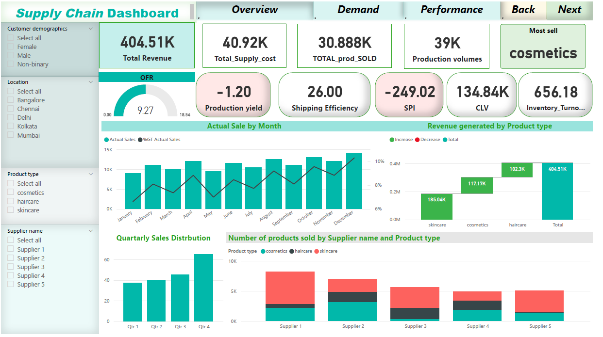
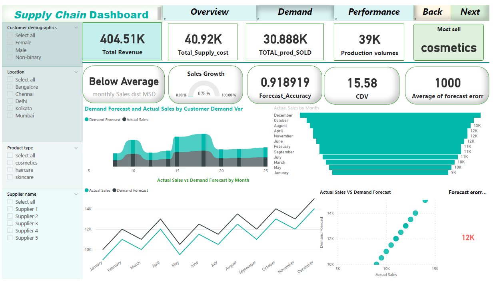
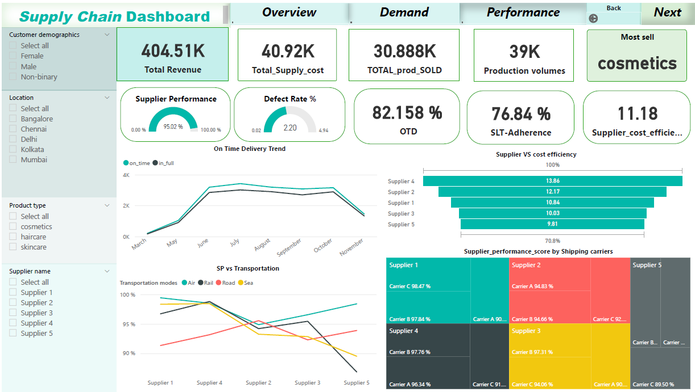

# Supply-chain-Business-Analysis
Supply chain dashboards play a crucial role in providing insights and visualizing key performance indicators (KPIs) across various stages of the supply chain. The types of supply chain dashboards can vary based on the specific needs and focus areas of a business
Analyze and visualize key metrics in the supply chain to optimize efficiency and decision-making.


## Table of Contents
- [:sparkler:Project Overview](#project-overview)
- [:thread:Data](#data)
- [:abacus:KPIS](KPI`s)
- [:mag_right:Analysis Techniques](#analysis-techniques)
- [:chart:Results](#results)
- [:inbox_tray:Getting Started](#getting-started)
  - [Prerequisites](#prerequisites)
  - [Installation](#installation)
- [Usage](#usage)
- [Contributing](#contributing)
- [License](#license)
## 
[Dashboard & Report](supply_chain.pdf)
## Project Overview

This data analysis project focuses on exploring and analyzing various supply chain metrics, including inventory levels, lead times, and supplier performance. The goal is to identify areas for improvement and make data-driven decisions to enhance the overall efficiency of the supply chain.


## Data

The project uses a dataset containing information about product availability, order quantities, lead times, supplier details, and other relevant supply chain metrics.
## KPI`s
Key Performance Indicators (KPIs) for a Demand Planning Dashboard using DAX involves defining measures that capture important metrics related to demand forecasting, actual sales, and forecast accuracy.

- Demand Planning Dashboard using DAX 
  - Demand Forecast KPI
          

          -- Demand_Forecast_KPI = AVERAGE(processed_data[Demand Forecast])

          -- Actual Sales KPI
            Actual_Sales_KPI = AVERAGE(processed_data[Actual Sales])
          
          -- Forecast Error KPI
            Forecast_Error_KPI = AVERAGE(processed_data[Forecast Error])
          
          -- Forecast Accuracy KPI
            Forecast_Accuracy_KPI = 1 - DIVIDE(AVERAGE(ABS(processed_data[Forecast Error])), AVERAGE(processed_data[Demand Forecast]))
          
          -- Customer Demand Variability KPI
            Customer_Demand_Variability_KPI = AVERAGE(processed_data[Customer Demand Variability])
          
          -- Sales Growth KPI
            Sales_Growth_KPI = (LASTDATE(processed_data[Date]) - FIRSTDATE(processed_data[Date])) / FIRSTDATE(processed_data[Date])
          
          -- Monthly Sales Growth KPI
            Monthly_Sales_Growth_KPI = (LASTDATE(processed_data[Date]) - FIRSTDATE(processed_data[Date])) / FIRSTDATE(processed_data[Date])
          
          -- Monthly Sales Distribution KPI
            Monthly_Sales_Distribution_KPI = 
              IF(
                  SELECTEDVALUE(processed_data[Actual Sales]) < MINX(ALL(processed_data), processed_data[Actual Sales]),
                  "Below Average",
                  IF(
                      SELECTEDVALUE(processed_data[Actual Sales]) > MAXX(ALL(processed_data), processed_data[Actual Sales]),
                      "Above Average",
                      "Average"
                      )
                  )
  -  Supplier Performance KPI
    - Supplier Performance Dashboard using DAX involves defining key performance indicators (KPIs) related to supplier performance
      

                    -- On-Time Delivery KPI
            On_Time_Delivery_KPI = 
                DIVIDE(
                    CALCULATE(COUNTROWS(FILTER(processed_data, processed_data[Actual Delivery Date] <= processed_data[Expected Delivery Date]))),
                    COUNTROWS(processed_data),
                    0
                )

              -- Supplier Lead Time Adherence KPI
              Supplier_Lead_Time_Adherence_KPI = 
                                  DIVIDE(
                                      CALCULATE(COUNTROWS(FILTER(processed_data, processed_data[Actual Delivery Date] - processed_data[Order Date] <= processed_data[Lead times]))),
                                      COUNTROWS(processed_data),
                                      0
                                  )
                
                -- Defect Rate KPI
                Defect_Rate_KPI = 
                    DIVIDE(
                        CALCULATE(COUNTROWS(FILTER(processed_data, processed_data[Defects] > 0))),
                        COUNTROWS(processed_data),
                        0
                    )
                
                -- Supplier Performance Score KPI
                Supplier_Performance_Score_KPI = 
                    (1 - [On_Time_Delivery_KPI]) * (1 - [Supplier_Lead_Time_Adherence_KPI]) * (1 - [Defect_Rate_KPI])
                
                -- Supplier Cost Efficiency KPI
                Supplier_Cost_Efficiency_KPI = 
                    DIVIDE(
                        CALCULATE(SUM(processed_data[Cost])),
                        CALCULATE(SUM(processed_data[Order Quantities])),
                        0
                    )


## Analysis Techniques

Utilizing descriptive statistics, time-series analysis, and supplier performance metrics, this project aims to uncover patterns, trends, and insights within the supply chain data.

## Results

Key findings include:
- Identification of peak demand periods.
- Supplier performance trends and areas for improvement.
- Optimization opportunities for inventory levels.

##
[Know more about supply chain](domain-knowledge.pdf)

## Getting Started

Follow these steps to set up and run the data analysis project locally.

### Prerequisites

Make sure you have the following installed:
- Python 3.x
- Jupyter Notebook
- Required Python libraries (NumPy, Pandas, Matplotlib, Seaborn)

### Installation

Clone the repository and install the required libraries:

                      ```bash
                      git clone https://github.com/abduallheid/Supply-chain-Business-Analysis.git
                      cd Supply-chain-Business-Analysis
                      pip install -r requirements.txt

## Usage
Run the Jupyter Notebook supply_chain_analysis.ipynb to reproduce the analysis and explore the results.

## Contributing
Contributions are welcome! Feel free to submit issues or open pull requests for improvements or additional analyses.

## License
This project is licensed under the MIT License.
